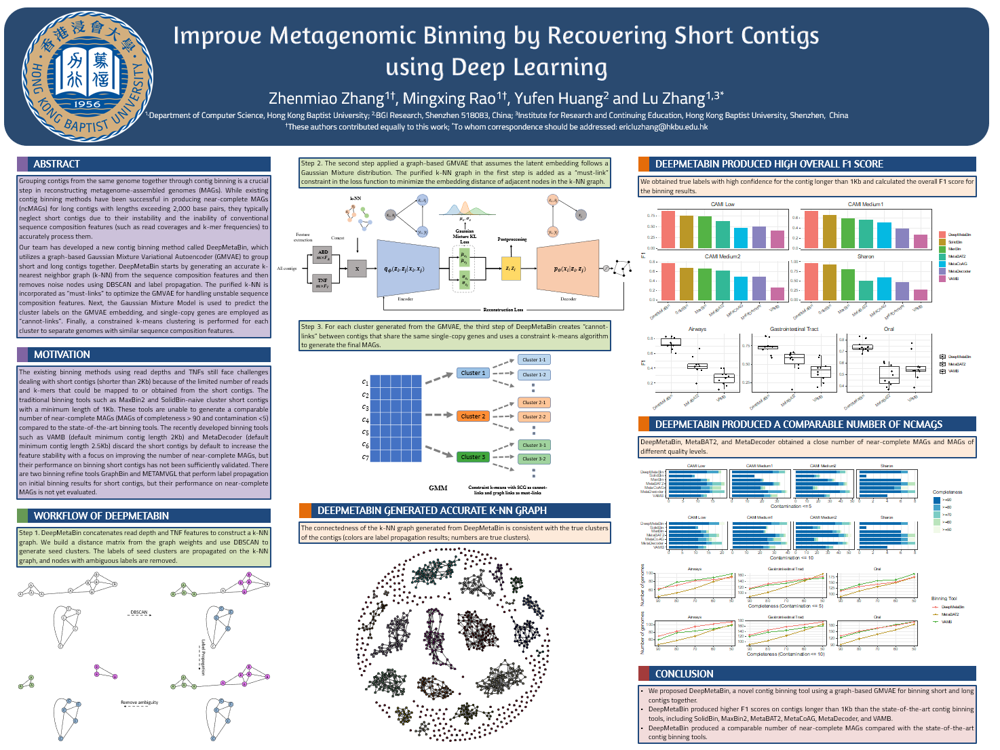

---

<div align="center">

#  A graph-based Gaussian Mixture Variational Autoencoder for Metagenome Binning

<a href="https://pytorch.org/get-started/locally/"></a>
<a href="https://pytorchlightning.ai/"></a>
<a href="https://hydra.cc/"></a>
<a href="https://github.com/ashleve/lightning-hydra-template"></a><br>
</div>

## Description

This repo contains implementations of deep learning method of metagenomic binning so-called DeepMetaBin,

The code repository is organized into the following components:
| Component | Description |
| --- | --- |
| [datamodules](https://github.com/mx-ethan-rao/deepmetabin/tree/multi_sample_finished/src/datamodules) | Contains torch dataset objects and pl.LightningDataModules for Graph embeded GMVAE in DeepMetaBin|
| [models](https://github.com/mx-ethan-rao/deepmetabin/tree/multi_sample_finished/src/models) | Contains torch module objects and pl.LightningModules for GMVAE, deepbin |
| [utils](https://github.com/mx-ethan-rao/deepmetabin/tree/multi_sample_finished/src/utils) | Contains util functions in the project, shared visualization and evaluation functions across different model backbones. |
| [configs](https://github.com/mx-ethan-rao/deepmetabin/tree/multi_sample_finished/configs) | Contains hydra based config files to control the experiments across differernt models. |

<p align="center"></p>
<p align="center"><em>Figure.</em> Poster Recomb 2023.</p>


## To Do List:
- :black_square_button: Update the Project Page of DeepMetaBin.
- :black_square_button: Released the arXiv version of DeepMetaBin (Under review).
- :white_check_mark: Released the early version of sample code.

## Software requirements
* [Gurobi>=10.0.1](https://anaconda.org/Gurobi/gurobi) (need to request for license)
* [bwa>=0.7.17](https://github.com/lh3/bwa)
* [samtools>=1.9](https://github.com/samtools/samtools)
* [checkM>=1.1.2](https://github.com/Ecogenomics/CheckM)

## Examples and experiments run on a Linux server with the following specifications:
* Dell PowerEdge R6525
* CPU: Dual 64-core AMD EPYC 7742 2.25GHz 256MB L3 cache
* Memory: 1T
* Operating System: Oracle Linux 8.7 (64-bit)

## Installation (estimated time: 10min)

Install dependencies

```bash
# clone project
git clone https://github.com/mx-ethan-rao/deepmetabin.git
cd deepmetabin

# [OPTIONAL] create conda environment
conda create -n myenv python=3.9
conda activate myenv

# install pytorch according to instructions
# https://pytorch.org/get-started/

# install requirements
pip install -r requirements.txt
```
## Single sample
### Preprocess Dataset From Scratch
```bash
bwa index my_contigs.fna 
bwa mem contigs.fasta reads_file_1 reads_file_2 -t 100 | samtools sort -@ 40 -n -o contigs.map.sorted.bam
python preprocessing.py --outdir /path/to/out --fasta my_contigs.fna --bamfiles *.bam --label_path /path/to/label.csv
```

### Preprocess Dataset from sample data (estimated running time for samle data: 1h)
Please download the sample dataset [sample_data](https://drive.google.com/drive/folders/1G8Wlws3HT4BtrBWG_KZk8w755MICpQXI?usp=sharing) and put it under deepmetabin folder
```bash
python preprocessing.py --outdir sample_data --fasta ./sample_data/contigs.fasta --bamfiles ./sample_data/contigs.map.sorted.bam --label_path ./sample_data/labels.csv
```
labels.csv is not used for training data and will be removed in next version

### Run for DeepMetaBin

```bash
python run.py datamodule.zarr_dataset_path=sample_data/data.zarr datamodule.output=deepmetabin_out
```
The binning result is under ./deepmetabin_out

## Multiple sample
### Preprocess Dataset From Scratch
```bash
python concatenate.py /path/to/catalogue.fna.gz /path/to/assemblies/sample1/contigs.fasta /path/to/assemblies/sample2/contigs.fasta  [ ... ]
bwa index /path/to/catalogue.fna.gz

bwa mem -p /path/to/reads_file_1 /path/to/catalogue.fna.gz -t 100 | samtools sort -@ 40 -n -o /path/to/output_bamfile

python preprocessing.py --outdir out --fasta /path/to/catalogue.fna.gz --bamfiles /path/to/bamfiles/*.bam --outdir /path/to/out --label_path /path/to/labels/*.csv
```
### Sample run for DeepMetaBin
```bash
bash ./bash/run_multisample.sh multisample_name ./out/catalogue.fna.gz ./out/tnf.npz ./out/rkpm.npz ./out/contignames.npz ./out/concat_label.csv ./deepmetabin_out
```
The binning result is under ./deepmetabin_out


## Reference Code

- https://github.com/ashleve/lightning-hydra-template
- https://github.com/samtools/samtools
- https://github.com/lh3/bwa

## License

This project is licensed under the MIT License - see the [LICENSE](LICENSE) file for details
