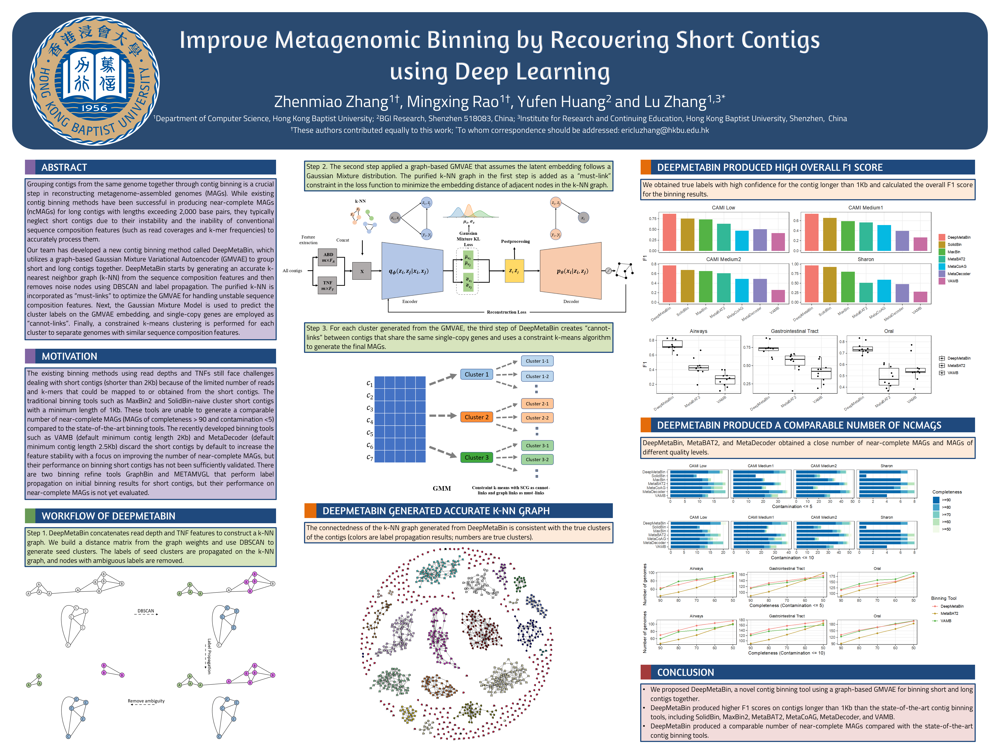

---

<div align="center">

#  A graph-based Gaussian Mixture Variational Autoencoder for Metagenome Binning

<a href="https://pytorch.org/get-started/locally/"></a>
<a href="https://pytorchlightning.ai/"></a>
<a href="https://hydra.cc/"></a>
<a href="https://github.com/ashleve/lightning-hydra-template"></a><br>
</div>

## Description

This repo contains implementations of deep learning method of metagenomic binning so-called DeepMetaBin,

The code repository is organized into the following components:
| Component | Description |
| --- | --- |
| [datamodules](https://github.com/mx-ethan-rao/deepmetabin/tree/multi_sample_finished/src/datamodules) | Contains torch dataset objects and pl.LightningDataModules for Graph embeded GMVAE in DeepMetaBin|
| [models](https://github.com/mx-ethan-rao/deepmetabin/tree/multi_sample_finished/src/models) | Contains torch module objects and pl.LightningModules for gmvae, deepbin |
| [utils](https://github.com/mx-ethan-rao/deepmetabin/tree/multi_sample_finished/src/utils) | Contains util functions in the project, shared visualization and evaluation functions across different model backbones. |
| [configs](https://github.com/mx-ethan-rao/deepmetabin/tree/multi_sample_finished/configs) | Contains hydra based config files to control the experiments across differernt models. |

<p align="center"></p>
<p align="center"><em>Figure.</em> Poster Recomb 2023.</p>


## To Do List:
- :black_square_button: Update the Project Page of DeepMetaBin.
- :black_square_button: Released the arXiv version of DeepMetaBin (Under review).
- :white_check_mark: Released the early version of sample code.


## How to run

Install dependencies

```bash
# clone project
git clone https://github.com/mx-ethan-rao/deepmetabin.git
cd deepmetabin

# [OPTIONAL] create conda environment
conda create -n myenv python=3.9
conda activate myenv

# install pytorch according to instructions
# https://pytorch.org/get-started/

# install requirements
pip install -r requirements.txt
```

## Preprocess Dataset From Scratch:
```
bwa index my_contigs.fna 
bwa mem contigs.fasta reads_file_1 reads_file_2 -t 100 | samtools sort -@ 40 -n -o contigs.map.sorted.bam
python preprocessing --outdir out --fasta my_contigs.fna --bamfiles *.bam
```

## Train model with default configuration

```bash
python run.py trainer.gpus=1 model.outpath deepmetabin_out datamodule.zarr_dataset_path
```

## Reference Code

- https://github.com/ashleve/lightning-hydra-template
- https://github.com/samtools/samtools
- https://github.com/lh3/bwa
